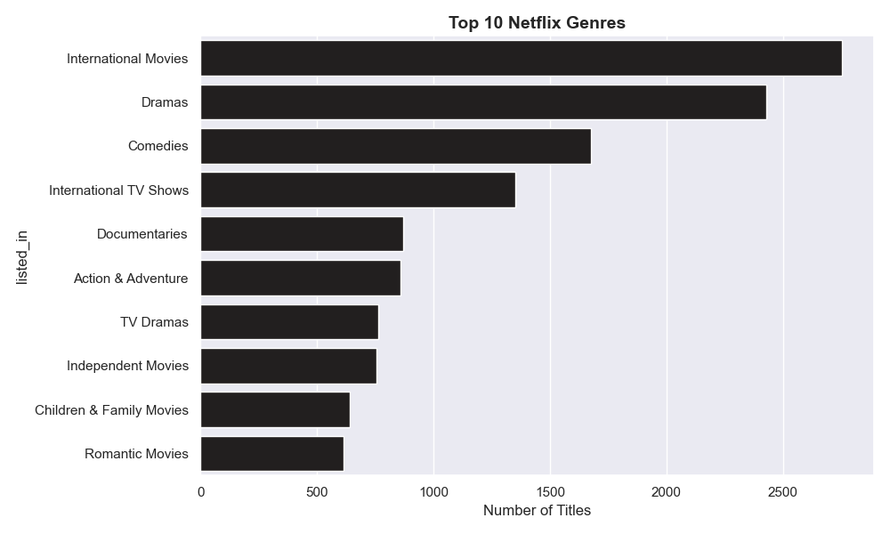
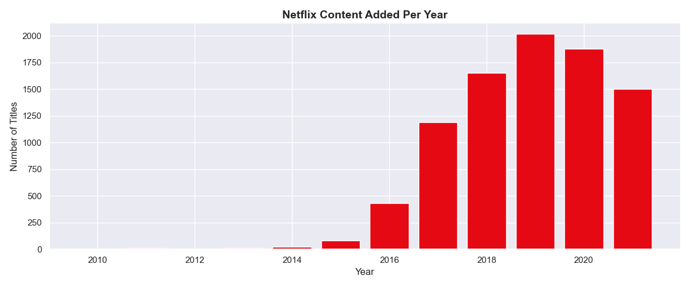
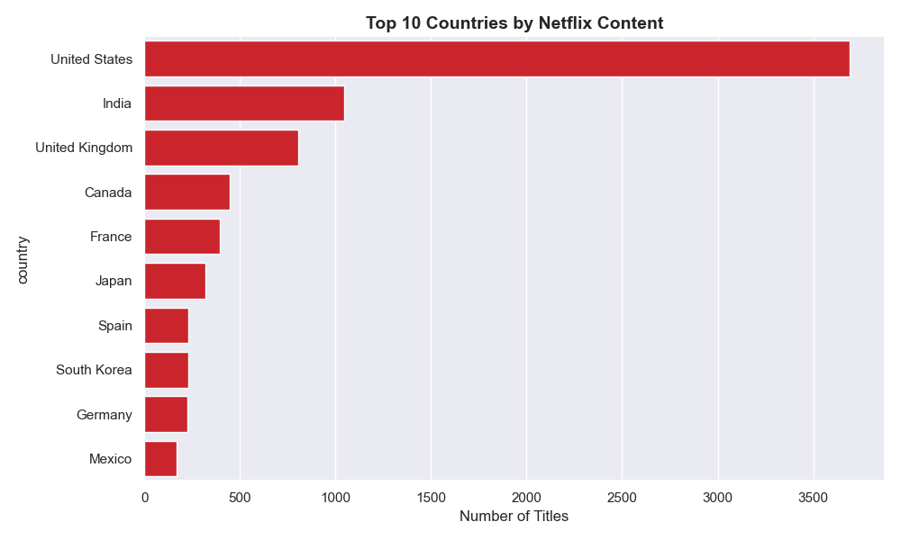
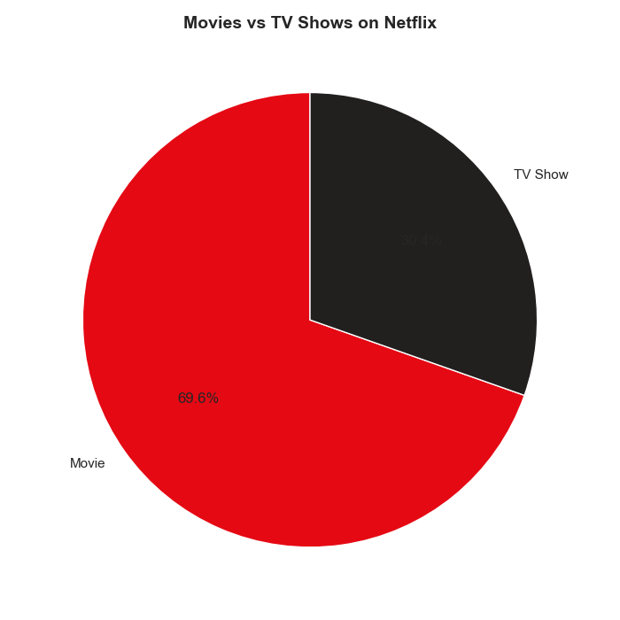
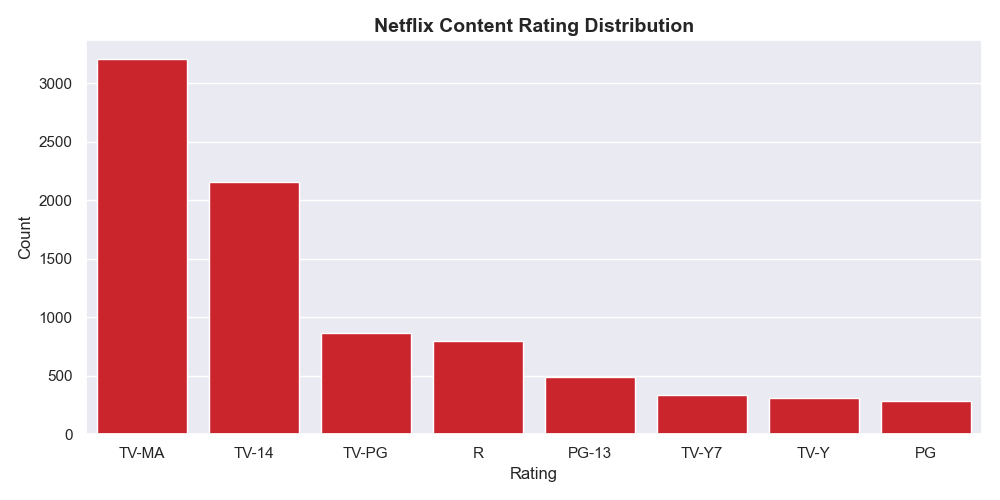

# 🎬 Netflix Content Analysis Dashboard

> End-to-end data analytics project analyzing 8,000+ Netflix titles using Python and Power BI.

---

## 📊 Project Overview

This project explores the Netflix content library through data cleaning, exploratory analysis, and an interactive Power BI dashboard styled with Netflix's iconic red and black branding. It uncovers trends in content growth, genre popularity, country distribution, and content ratings.

---

## 🎯 Key Business Insights

| Metric | Value |
|---|---|
| 🎬 Total Titles | 7,969 |
| 🎥 Total Movies | 5,691 (71.43%) |
| 📺 Total TV Shows | 2,276 (28.57%) |
| 🌍 Total Countries | 750 |
| ⭐ Total Ratings | 20 |
| 🎭 Total Genres | 499 |

### 🔍 Key Findings:
- **Movies dominate** Netflix at 71.43% of all content
- **Documentaries** are the most common genre
- **United States** produces the most content by far
- **India** is the second largest content producer
- Netflix content grew **rapidly from 2015 to 2019** then slowed
- **TV-MA** is the most common rating — Netflix targets adult audiences
- **International Dramas** are hugely popular showing Netflix's global strategy

---

## 🛠️ Tools & Technologies

| Tool | Purpose |
|---|---|
| Python (Pandas, Matplotlib, Seaborn) | Data cleaning, EDA, chart generation |
| Power BI Desktop | Interactive dashboard & visualization |
| GitHub | Version control & portfolio hosting |

---

## 📁 Project Structure

```
netflix-content-analysis/
│
├── clean.py                  # Data cleaning script
├── analyze.py                # EDA & chart generation
├── netflix_clean.csv         # Cleaned dataset (7,969 titles)
├── netflix_dashboard.pbix    # Power BI dashboard file
│
└── charts/
    ├── 1_movies_vs_tvshows.png
    ├── 2_content_per_year.png
    ├── 3_top_countries.png
    ├── 4_top_genres.png
    └── 5_ratings.png
```

---

## 🔄 Workflow

### Step 1 — Data Cleaning (Python)
- Loaded raw CSV with `pandas`
- Fixed date formats and extracted year/month added
- Filled missing values for director, cast, country, rating
- Removed invalid type values — kept only Movie and TV Show
- Removed Unknown countries
- Filtered to 2008-2021 date range
- Exported clean CSV with 7,969 rows

### Step 2 — Python EDA & Visualization
- Analyzed Movies vs TV Shows distribution
- Tracked content growth year by year
- Identified top 10 content producing countries
- Explored top genres and content ratings
- Generated 5 professional charts

### Step 3 — Power BI Dashboard
- Built Netflix-branded dark red & black dashboard
- Created 6 KPI cards
- Added interactive charts:
  - Genres bar chart (Top 10)
  - Movies vs TV Shows donut chart
  - Ratings distribution bar chart
  - Top 10 Countries treemap
  - Content growth area chart (2008-2021)

---

## 📸 Dashboard Preview







---

## 🚀 How to Run

### Python Scripts
```bash
# Install dependencies
pip install pandas numpy matplotlib seaborn

# Clean the data
python clean.py

# Generate analysis & charts
python analyze.py
```

### Power BI Dashboard
1. Open `netflix_dashboard.pbix` in Power BI Desktop
2. If prompted, update the CSV file path to your local path
3. Interact with charts — clicking any visual filters all others!

---

## 📦 Dataset

- **Source:** [Netflix Movies and TV Shows - Kaggle](https://www.kaggle.com/datasets/shivamb/netflix-shows)
- **Original Rows:** 8,807 titles
- **Clean Rows:** 7,969 titles
- **Period:** 2008 - 2021
- **Coverage:** 750 countries/regions worldwide

---

## 👤 Author

**Kavi Gamage**
- GitHub: [@kavigamage-da](https://github.com/kavigamage-da)

---

*This project is part of my data analytics portfolio demonstrating Python EDA and Power BI dashboard skills.*
